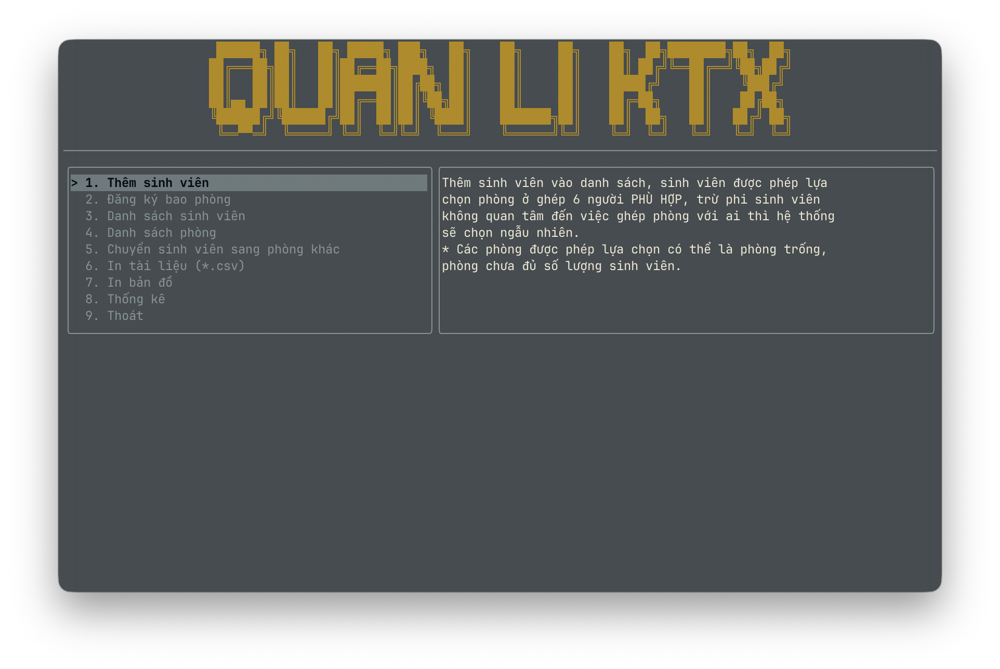

# PBL2 - Hệ Thống Quản Lý Ký Túc Xá (Dormitory Management System)



Đây là đồ án **PBL2 (Project Based Learning 2)**, một ứng dụng quản lý ký túc xá được viết bằng ngôn ngữ **C++** sử dụng giao diện dòng lệnh (TUI - Terminal User Interface) với thư viện **FTXUI**.

## 🚀 Tính Năng Chính

Hệ thống cung cấp các chức năng quản lý toàn diện cho một ký túc xá:

*   **Quản Lý Sinh Viên**:
    *   Thêm mới sinh viên vào ký túc xá.
    *   Xem danh sách sinh viên.
    *   Xem chi tiết thông tin sinh viên.
    *   Chuyển phòng cho sinh viên.
    *   Tìm kiếm và lọc sinh viên.
*   **Quản Lý Phòng**:
    *   Xem danh sách các phòng (theo tòa, tầng).
    *   Xem trạng thái phòng (trống, đầy, đang bảo trì).
    *   Đặt phòng (Room Reservation).
*   **Quản Lý Phương Tiện**:
    *   Đăng ký xe cho sinh viên.
    *   Quản lý thông tin xe ra/vào (nếu có).
*   **Quản Lý Hóa Đơn & Phí**:
    *   Tính toán và quản lý tiền phòng.
    *   Ghi nhận và tính tiền điện/nước.
*   **Thống Kê & Báo Cáo**:
    *   Xem các biểu đồ thống kê (sử dụng thư viện FTXUI để vẽ biểu đồ).
    *   Xuất dữ liệu ra file CSV (`.csv`) để lưu trữ hoặc xử lý thêm.

## 🛠 Công Nghệ Sử Dụng

*   **Ngôn Ngữ**: C++ (Standard C++17 trở lên).
*   **Giao Diện (UI)**: [FTXUI](https://github.com/ArthurSonzogni/FTXUI) (Functional Terminal User Interface).
*   **Cơ Sở Dữ Liệu**:
    *   **LevelDB**: Sử dụng Google LevelDB để lưu trữ dữ liệu chính (key-value storage) cho hiệu suất cao.
    *   **SQLite**: Được sử dụng trong một số công cụ kiểm tra dữ liệu (`check_database.py`).
*   **Build System**: CMake.
*   **Công Cụ Hỗ Trợ**: Python (cho các script build và quản lý project).

## ⚙️ Yêu Cầu Hệ Thống

*   **Hệ điều hành**: Windows, Linux, hoặc macOS.
*   **Trình biên dịch C++**: Hỗ trợ C++17 (GCC, Clang, hoặc MSVC).
*   **CMake**: Phiên bản 3.12 trở lên.
*   **Python 3**: Để chạy script `tools.py`.
*   **Git**: Để tải các thư viện phụ thuộc (FTXUI, LevelDB) tự động qua CMake FetchContent.

## 📦 Hướng Dẫn Cài Đặt và Chạy

Dự án đi kèm với một script Python tiện ích `tools.py` giúp đơn giản hóa quá trình build và chạy.

### 1. Clone dự án

```bash
git clone <repository_url>
cd PBL2
```

### 2. Sử dụng công cụ tự động (Khuyên dùng)

Chạy script `tools.py`:

```bash
python3 tools.py
```

Menu sẽ hiện ra với các tùy chọn:
1.  **Reset project**: Xóa thư mục build cũ và tạo mới.
2.  **Biên dịch chương trình**: Chạy CMake để build project.
3.  **Chạy chương trình**: Khởi động ứng dụng.
4.  **Thoát**.

**Quy trình lần đầu:** Chọn **1 (Reset)** -> **2 (Biên dịch)** -> **3 (Chạy)**.

### 3. Build thủ công (Manual Build)

Nếu không muốn dùng script Python, bạn có thể chạy các lệnh CMake chuẩn:

```bash
# Tạo thư mục build
mkdir build
cd build

# Cấu hình CMake (tải thư viện và tạo makefiles/project files)
cmake ..

# Biên dịch
cmake --build .

# Copy tài nguyên (quan trọng)
# Trên Linux/macOS
cp -r ../res .
# Trên Windows
xcopy /s /e /i ..\res res
```

### 4. Chạy ứng dụng

Sau khi build thành công:

*   **Linux/macOS**: `./pbl` (trong thư mục build).
*   **Windows**: Chạy `pbl.exe` (trong thư mục `build/Debug` hoặc `build/Release`).

## 📂 Cấu Trúc Thư Mục

*   `src/`: Mã nguồn chính của chương trình (`.cpp`).
    *   `apps/`: Các màn hình và logic ứng dụng (Menu, StudentList, RoomList...).
    *   `models/`: Các lớp Entity (Student, Room...) và xử lý dữ liệu.
    *   `viewmodel/`: Lớp trung gian xử lý logic giữa Model và View (MVVM pattern).
    *   `objects/`: Các đối tượng phụ trợ (Date, Queue, Vector...).
*   `include/`: Các file header (`.h`, `.hpp`).
*   `res/`: Tài nguyên (Database gốc, hình ảnh hoặc file cấu hình nếu có).
*   `tools.py`: Script quản lý build/run.
*   `check_database.py`: Script Python để kiểm tra nhanh dữ liệu trong DB.

## 👥 Tác Giả

*   **Eins** (Nhat Nguyen/antialberteinstein)
*   Và các thành viên nhóm thực hiện đồ án PBL2.

---
*Lưu ý: Dự án sử dụng LevelDB, dữ liệu sẽ được tạo trong thư mục chạy chương trình (thường là trong `build/res/db`). Đảm bảo thư mục `res` luôn được copy đi kèm với file thực thi.*
